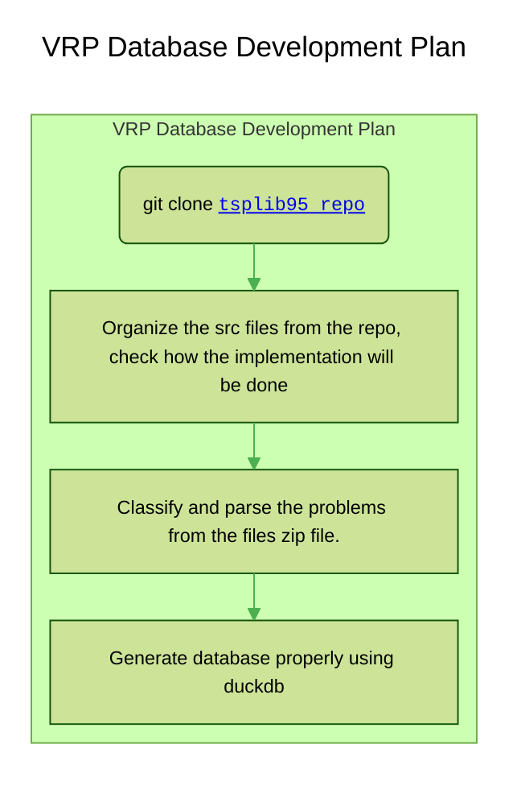

# tsplib converter

This repository contains Python scripts that convert TSP, VRP and other variations using tsplib95 as backend, converting the files to a json format or creating a duckdb database. With it you may:

## core functionalities

### Convert tsplib files to json format and create duckdb database with instances and their characteristics

1. Convert tsplib files to json format (or other format, maybe yaml, parquet, etc) for easier parsing and data extraction.
2. Create a duckdb database with all the instances and their characteristics.

### Convert problems to tsp instances

1. Characterize problems with different extension types or parsing logics (e.g. Courdeau, Augerat, Solomon, etc) and convert them into ts instances.
2. Create a database with all the instances and their characteristics

<!-- 
### Download and parse benchmark instances from various sources

https://neo.lcc.uma.es/vrp/vrp-flavors/
<https://neo.lcc.uma.es/vrp/vrp-instances/capacitated-vrp-instances/>
<https://neo.lcc.uma.es/vrp/vrp-instances/>
<http://vrp.atd-lab.inf.puc-rio.br/index.php/en/>
<https://www.mech.kuleuven.be/en/cib/op#autotoc-item-autotoc-2>
<https://neo.lcc.uma.es/vrp/vrp-instances/>
<https://neo.lcc.uma.es/vrp/vrp-instances/capacitated-vrp-instances/>
<https://neo.lcc.uma.es/vrp/vrp-instances/multiple-depot-vrp-instances/>
<https://neo.lcc.uma.es/vrp/vrp-instances/description-for-files-of-cordeaus-instances/>
<https://neo.lcc.uma.es/vrp/vrp-instances/multiple-depot-vrp-with-time-windows-instances/>
<https://neo.lcc.uma.es/vrp/vrp-instances/periodic-vrp-instances/>
<https://neo.lcc.uma.es/vrp/vrp-instances/vehicle-routing-problem-with-pick-up-and-deliveries/>
 -->

## How it works

Inside datasets are the zipped files downloaded from the sources above. The scripts will unzip them, parse them and convert them to json format, saving them in the archives folder. Then, it will create a duckdb database with all the instances and their characteristics.

## How it must achieve it

1. Evaluate the datasets and their characteristics, i.e., read the file and identify different patterns for it.
   1. At first, we'll start with the tsplib95 formats, as they are.
   2. The we'll move to other types of problems.
   3. We'll do this progressively, starting with the easiest ones.
2. Then, create a parser for each pattern identified.
3. Finally, convert the parsed data to tsplib then to json format and save it in the `datasets/parsed_datasets` folder.

# Current context

It's backend is based on the tsplib 95 files, and the files are in the `datasets` folder. The main files for tsplib are in the `src/tsplib_converter` folder.

## Testing

The system has comprehensive test coverage to ensure reliability:

### Quick Test Commands

```bash
# Run all tests (134 tests)
uv run pytest tests/ -v

# Run with coverage report
uv run pytest tests/ --cov=src --cov-report=term-missing

# Quick test run
uv run pytest tests/ -q
```

### Test Suite Overview

- **Total Tests**: 134 ✅
- **Pass Rate**: 100% (134/134)
- **Code Coverage**: 63% (Core modules: 80-100%)
- **Test Categories**:
  - Unit Tests: 109 tests
  - Integration Tests: 25 tests

### Test Files

1. **Format Module Tests** (24 tests)
   - `test_format_parser.py` - Format detection and parsing (9 tests)
   - `test_extraction.py` - Field extraction and validation (15 tests)

2. **Converter Module Tests** (85 tests)
   - `test_converter_api.py` - File processing API (13 tests)
   - `test_transformer.py` - Data transformation (17 tests)
   - `test_json_writer.py` - JSON output (17 tests)
   - `test_database.py` - DuckDB operations (21 tests)
   - `test_scanner.py` - File discovery (17 tests)

3. **Integration Tests** (25 tests)
   - `test_pipeline.py` - Full ETL pipeline (8 tests)
   - `test_cli.py` - CLI commands (17 tests)

### Core Module Coverage

- **Transformer**: 100% ✅
- **Scanner**: 94% ✅
- **JSON Writer**: 89% ✅
- **Database**: 85% ✅
- **CLI Commands**: 80% ✅

For detailed testing information, see:

- `TESTING_SUMMARY.md` - Complete test documentation
- `TEST_COMMANDS.md` - Quick reference for test commands

# Development plan



# TODOs

- [ ] set up the workspace:
  - [x] create venv with uv
  - [ ] install duckdb, tsplib95
  - [ ] install other dependencies
  - [ ] CREATE THE REPO INSTRUCTIONS FILE.
  - [ ] Download the other datasets
  - [ ] correctly organize the dataset progressively.
- [ ] Start by defining the current development objective, which is simply to extract the correctly parsed files from tsplib95 and convert them to json format or duckdb
  - the files are inside datasets/ folder.
