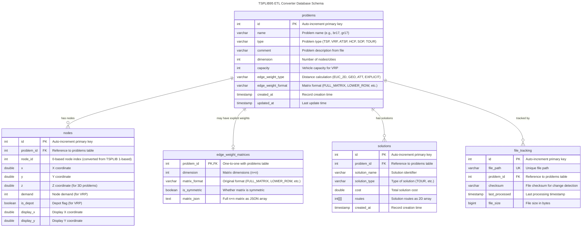

# Database Schema - Entity Relationship Diagram

This diagram shows the database structure for the TSPLIB95 ETL Converter project, which processes TSPLIB95 routing problems into a structured DuckDB database.

## Mermaid ER Diagram

```mermaid
erDiagram
    problems ||--o{ nodes : "has"
    problems ||--o| edge_weight_matrices : "has"
    problems ||--o{ solutions : "has"
    problems ||--o{ file_tracking : "tracks"

    problems {
        INTEGER id PK "Auto-increment"
        VARCHAR name "Problem instance name"
        VARCHAR type "TSP, VRP, ATSP, HCP, SOP, TOUR"
        VARCHAR comment "Problem description"
        INTEGER dimension "Number of nodes"
        INTEGER capacity "Vehicle capacity (VRP)"
        VARCHAR edge_weight_type "EUC_2D, EXPLICIT, GEO, etc"
        VARCHAR edge_weight_format "FULL_MATRIX, UPPER_ROW, etc"
        INTEGER capacity_vol "Volume capacity (VRP)"
        INTEGER capacity_weight "Weight capacity (VRP)"
        DOUBLE max_distance "Maximum route distance"
        DOUBLE service_time "Service time per node"
        INTEGER vehicles "Number of vehicles"
        INTEGER depots "Number of depot nodes"
        INTEGER periods "Number of periods (PVRP)"
        BOOLEAN has_time_windows "Has time window constraints"
        BOOLEAN has_pickup_delivery "Has pickup-delivery"
        TIMESTAMP created_at
        TIMESTAMP updated_at
    }

    nodes {
        INTEGER id PK "Auto-increment"
        INTEGER problem_id FK "References problems.id"
        INTEGER node_id "Node identifier (0-based)"
        DOUBLE x "X coordinate"
        DOUBLE y "Y coordinate"
        DOUBLE z "Z coordinate (3D problems)"
        INTEGER demand "Node demand (VRP)"
        BOOLEAN is_depot "Depot flag"
        DOUBLE display_x "Display X coordinate"
        DOUBLE display_y "Display Y coordinate"
    }

    edge_weight_matrices {
        INTEGER problem_id PK_FK "References problems.id"
        INTEGER dimension "Matrix dimension (n×n)"
        VARCHAR matrix_format "FULL_MATRIX, LOWER_ROW, etc"
        BOOLEAN is_symmetric "Symmetric matrix flag"
        TEXT matrix_json "Full matrix as JSON array"
    }

    solutions {
        INTEGER id PK "Auto-increment"
        INTEGER problem_id FK "References problems.id"
        VARCHAR solution_name "Solution identifier"
        VARCHAR solution_type "TOUR, ROUTE, etc"
        DOUBLE cost "Solution cost/distance"
        INTEGER_ARRAY_ARRAY routes "Route sequences"
        TIMESTAMP created_at
    }

    file_tracking {
        INTEGER id PK "Auto-increment"
        VARCHAR file_path UK "Unique file path"
        INTEGER problem_id FK "References problems.id"
        VARCHAR checksum "File checksum (MD5)"
        TIMESTAMP last_processed
        BIGINT file_size "File size in bytes"
    }
```

## Key Design Decisions

1. **No edges table**: Edge weights are either computed on-demand from node coordinates (for EUC_2D, GEO, ATT) or stored as full matrices in `edge_weight_matrices` for EXPLICIT distance problems (ATSP, asymmetric TSP). Creating an edges table would cause O(n²) explosion (e.g., rbg443 would need 196,249 edge rows).

2. **Separate edge_weight_matrices table**: For ATSP and other EXPLICIT edge weight problems, distance matrices are stored as full dimension×dimension JSON arrays. This separation keeps the problems table lightweight while supporting efficient matrix queries.

3. **1-based to 0-based conversion**: TSPLIB95 format uses 1-based indexing for nodes. The transformation layer converts all node IDs to 0-based for database storage.

4. **Problem type support**: Currently handles TSP, VRP, ATSP, HCP, SOP, TOUR instances with room for expansion.

## Schema Diagram



## Table Descriptions

### problems

Central table containing metadata for each routing problem. Stores problem characteristics extracted from TSPLIB95 files.

**Current data**: 19 ATSP problems (br17, ft53, ft70, etc.)

**Index**: `idx_problems_type_dim` on (type, dimension) for efficient filtering

### nodes

Stores node coordinates and metadata. For coordinate-based problems (EUC_2D, GEO, ATT), distances are computed on-demand from these coordinates using the appropriate distance function.

**Index conversion**: All node_id values are 0-based (TSPLIB95 uses 1-based indexing)

**VRP support**: Includes demand and is_depot fields for vehicle routing problems

### edge_weight_matrices

Stores explicit distance matrices for ATSP and other EXPLICIT edge weight type problems. The matrix is stored as a full dimension×dimension JSON array regardless of the original format.

**Supported formats**:

- FULL_MATRIX (complete n×n matrix)
- LOWER_ROW, LOWER_DIAG_ROW (lower triangular)
- UPPER_ROW, UPPER_DIAG_ROW (upper triangular)
- Column variants of above

**Example storage**:

- br17.atsp: 17×17 = 289 entries, ~1 KB JSON
- rbg443.atsp: 443×443 = 196,249 entries, ~770 KB JSON

**Design rationale**: Separate table prevents bloating the problems table. One-to-one relationship with problems ensures referential integrity.

> **Q: Why doesn't edge_weight_matrices have an `id` column?**
>
> **A:** The table uses `problem_id` as the PRIMARY KEY (marked PK,FK in the diagram). This is a one-to-one relationship with the `problems` table, meaning each problem can have at most one edge weight matrix. Since `problem_id` is unique and serves as the primary key, no separate auto-increment `id` is needed. This is correct database design for one-to-one relationships.

### solutions

Stores optimal or known solutions for problems. Routes are stored as 2D integer arrays to support both single-route (TSP) and multi-route (VRP) solutions.

> **Q: Why do solutions only support TSP and VRP and not other types?**
>
> **A:** This documentation is **misleading**. The schema actually supports ALL problem types:
>
> - **TSP/ATSP**: Single route like `[[0,1,2,3,...,n,0]]`
> - **VRP**: Multiple routes like `[[0,1,2,0], [0,3,4,5,0]]`
> - **HCP**: Hamiltonian cycle (single route)
> - **SOP**: Sequential ordering path (single route with precedence constraints)
> - **TOUR**: Tour solutions (same as TSP)
>
> The `int[][] routes` 2D array structure can represent any type of tour/route solution. The documentation should say "supports single-route (TSP, ATSP, HCP, SOP) and multi-route (VRP) solutions."

### file_tracking

Tracks processed files to enable incremental processing. Uses checksums to detect file changes and avoid reprocessing unchanged files.

**Change detection**: SHA-256 checksum comparison
**Performance optimization**: Only processes files that have changed since last run

## Relationships

- **problems → nodes**: One-to-many (a problem has multiple nodes)
- **problems → edge_weight_matrices**: One-to-one (only EXPLICIT problems have matrices)
- **problems → solutions**: One-to-many (a problem can have multiple solutions)
- **problems → file_tracking**: One-to-many (tracks file versions)

## Edge Weight Storage Strategy

> **IMPORTANT**: The decision to store edge weights in the `edge_weight_matrices` table is based on the **EDGE_WEIGHT_TYPE** keyword in the TSPLIB95 file, NOT on the problem TYPE (TSP vs ATSP vs VRP).

### Problems with EDGE_WEIGHT_TYPE = EXPLICIT

**When a file specifies `EDGE_WEIGHT_TYPE: EXPLICIT`:**

- ✅ Store: Full n×n matrix in `edge_weight_matrices` table as JSON
- ✅ Convert: All formats (FULL_MATRIX, LOWER_ROW, etc.) to full matrix representation  
- ✅ Preserve: Original `matrix_format` for reference
- ❌ No nodes: Explicit weight files typically don't include node coordinates

**Examples:**

- `br17.atsp`: TYPE=ATSP, EDGE_WEIGHT_TYPE=EXPLICIT, EDGE_WEIGHT_FORMAT=FULL_MATRIX
  - 17×17 = 289 distance values provided in file
  - Stored in edge_weight_matrices table
  - No coordinate data to store in nodes table

### Problems with EDGE_WEIGHT_TYPE = (EUC_2D, GEO, ATT, etc.)

**When a file specifies coordinate-based distances:**

- ✅ Store: Node coordinates in `nodes` table
- ✅ Compute: Distances calculated on-demand using appropriate distance function
- ❌ No matrix storage: No entry in edge_weight_matrices table

**Examples:**

- `gr17.tsp`: TYPE=TSP, EDGE_WEIGHT_TYPE=EUC_2D  
  - Node coordinates provided (x, y for each node)
  - Distances computed using Euclidean formula: `sqrt((x2-x1)² + (y2-y1)²)`
  - No edge weight matrix stored

### Why This Distinction Matters

The TSPLIB95 specification allows ANY problem type (TSP, ATSP, VRP, etc.) to use EITHER explicit weights OR coordinate-based weights:

- **TSP with EXPLICIT weights**: Possible (stores matrix)
- **TSP with EUC_2D weights**: Possible (stores coordinates)
- **ATSP with EXPLICIT weights**: Common (stores matrix) ← br17.atsp example
- **ATSP with coordinates**: Theoretically possible but rare

The file content determines storage, not the problem type label.

### EXPLICIT distance problems (with matrix storage)

- ✅ Store: full n×n matrix in `edge_weight_matrices` as JSON
- ✅ Convert: All formats to full matrix representation
- ✅ Preserve: Original matrix_format for reference

> **Q: Are you sure the matrix is being generated correctly? Is there validation?**
>
> **A:**
>
> - **Generation**: The transformer.py code correctly converts all 9 TSPLIB95 matrix formats to full n×n matrices using the Matrix classes. The conversion logic is mathematically sound (verified in MATRIX_REVIEW.md).
> - **Validation**: ⚠️ **CRITICAL GAP** - There is currently NO validation that the number of weights matches the expected size for the format and dimension. For example:
>   - LOWER_ROW with dimension=10 needs 10×9/2 = 45 elements
>   - If file provides only 40 elements, code will raise IndexError when accessing matrix[i,j]
>   - Should raise clear ParseError instead
> - **Action needed**: Add dimension validation in Matrix.**init**() or transformer._convert_edge_weights_to_matrix()

> **Q: Are those all the formats?**
>
> **A:** Yes, all 9 TSPLIB95 EDGE_WEIGHT_FORMAT types are implemented:
>
> 1. FULL_MATRIX
> 2-3. UPPER_ROW, UPPER_DIAG_ROW  
> 4-5. LOWER_ROW, LOWER_DIAG_ROW
> 6-7. UPPER_COL, UPPER_DIAG_COL
> 8-9. LOWER_COL, LOWER_DIAG_COL
>
> Plus FUNCTION (which means no matrix, compute from coordinates). See MATRIX_REVIEW.md for detailed verification.

### Why not store all edges?

For a problem with n nodes, storing all edges requires n² rows. Examples:

- br17 (17 nodes): 289 edges
- rbg443 (443 nodes): 196,249 edges

Matrix storage is more efficient than row-per-edge for dense graphs.

## See Also

- [Architecture Documentation](../reference/ARCHITECTURE.md)
- [Database Operations](../../src/converter/database/operations.py)
- [Matrix Implementation](../../src/tsplib_parser/matrix.py)
