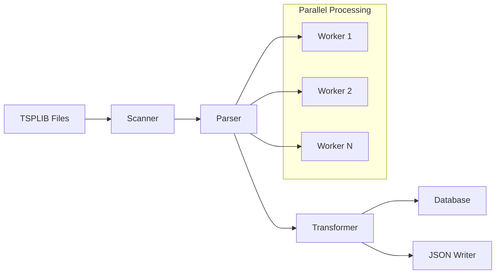

# Architecture Guide - TSPLIB95 ETL System

## System Overview

The TSPLIB95 ETL System is a production-grade pipeline designed to convert routing problem instances from the academic TSPLIB95 format into modern, queryable data formats (JSON and DuckDB). The system processes thousands of files efficiently while maintaining data integrity and providing comprehensive analytics capabilities.

## Design Philosophy

### Core Principles

1. **Separation of Concerns**: Each phase (Extract, Transform, Load) is isolated with clear interfaces
2. **Dependency Injection**: All components receive their dependencies explicitly for testability
3. **Fail-Fast Validation**: Catch data issues early with comprehensive validation
4. **Performance by Design**: Built for parallel processing and large datasets from day one
5. **Academic Fidelity**: Preserves all TSPLIB95 semantics while modernizing the format

### Key Design Decisions

#### Why 3-Phase Architecture?

```
Phase 1 (Extract) → Phase 2 (Transform) → Phase 3 (Load)
    TSPLIB95        Normalize & Validate     JSON + DuckDB
```

**Rationale**: Academic routing problems have complex, domain-specific formats that require specialized parsing, then normalization for modern analytics, then storage optimization for different use cases.

#### Why DuckDB + JSON Dual Output?

- **DuckDB**: Enables SQL analytics, joins across problems, aggregations
- **JSON**: Provides language-agnostic access for ML/visualization tools
- **Both**: Different use cases require different access patterns

#### Why Vendored TSPLIB95 Library?

The original `tsplib95` library handles the complex parsing logic for 30+ years of academic file formats. Rather than reimplement:

- We extend it with our own improvements (`src/parsing/`)
- We add missing VRP variants and validation
- We maintain compatibility with the research community

## Architecture Components

### Layer 1: Input Processing (`src/parsing/`)

**Purpose**: Extract data from TSPLIB95 files with full format compliance

```python
# Entry point: TSPLIBParser.parse_file()
from src.parsing.converter import TSPLIBParser

parser = TSPLIBParser(logger=logger)
raw_data = parser.parse_file("problem.tsp")
```

**Key Components**:

- `converter.py` - Main parser interface wrapping tsplib95
- `core.py` - Enhanced StandardProblem with VRP extensions  
- `loaders.py` - File loading with validation and error recovery
- `improvements.md` - Documents extensions beyond standard TSPLIB95

**Critical Pattern**: The parser preserves TSPLIB95's 1-based indexing until transformation phase.

### Layer 2: Core Processing (`src/converter/core/`)

**Purpose**: Orchestrate the ETL pipeline with parallel processing and error handling

#### File Scanner (`scanner.py`)

```python
# Discovers files with precise pattern matching
scanner = FileScanner(batch_size=100, logger=logger)
files = scanner.scan_files("datasets_raw/problems", ["*.tsp", "*.vrp"])
```

**Design Choice**: Uses exact glob patterns rather than generic `*.*` to ensure proper type detection and avoid processing non-TSPLIB files.

#### Data Transformer (`transformer.py`)

```python
# Normalizes data for database storage
transformer = DataTransformer(logger=logger)
normalized = transformer.transform_problem(raw_data)
```

**Critical Functions**:

- `_convert_to_zero_based()` - Converts 1-based TSPLIB indices to 0-based database indices
- `_extract_nodes()` - Handles coordinate extraction with proper NULL handling
- `_compute_edges()` - Only precomputes edges for EXPLICIT weight types (avoids O(n²) for coordinate problems)

### Layer 3: Storage & Output (`src/converter/database/`, `src/converter/output/`)

#### Database Layer (`database/operations.py`)

```python
# Thread-safe database operations for parallel processing
db = DatabaseManager("routing.duckdb", logger=logger)
problem_id = db.insert_problem(problem_data)
```

**Schema Design**:

```sql
-- Core tables with foreign key relationships
problems(id, name, type, dimension, capacity, ...)
nodes(id, problem_id, node_id, x, y, demand, is_depot, ...)
edges(id, problem_id, from_node, to_node, weight, ...)
tours(id, problem_id, tour_data, optimal_value, ...)
file_tracking(id, file_path, file_hash, last_modified, ...)
```

**Key Features**:

- **Incremental Updates**: `file_tracking` table enables change detection
- **Thread Safety**: Each worker gets its own database connection
- **Bulk Operations**: Prepared statements for efficient batch inserts

#### JSON Output (`output/json_writer.py`)

```python
# Flattened JSON structure optimized for analysis
writer = JSONWriter("datasets/json", logger=logger)
writer.write_problem(problem_data, "tsp/gr17.json")
```

**Format Design**: Flattened structure that's easier to consume than nested TSPLIB95 format:

```json
{
  "problem": {"name": "gr17", "type": "TSP", "dimension": 17},
  "nodes": [{"node_id": 0, "x": 38.24, "y": 20.42, "demand": 0}],
  "solution": {"tour": [0, 1, 2, ...], "distance": 2085}
}
```

#### Parquet Output (`output/parquet_writer.py`) ⭐ NEW

```python
# Export database tables to columnar Parquet format
from converter.output.parquet_writer import export_database_to_parquet

files = export_database_to_parquet(
    db_path="datasets/db/routing.duckdb",
    output_dir="datasets/parquet",
    compression="snappy"  # or 'gzip', 'zstd', 'uncompressed'
)
```

**Format Benefits**:

- **Columnar Storage**: Optimized for analytics (group by, aggregations)
- **Compression**: 23-45% smaller than JSON (snappy: 6.27 MB vs JSON: 8.14 MB)
- **Interoperability**: Works with pandas, polars, DuckDB, Spark, Arrow
- **Fast I/O**: Read only columns needed (predicate pushdown)

**Compression Options**:

| Codec | Compression Ratio | Speed | Use Case |
|-------|------------------|-------|----------|
| `snappy` (default) | 0.77x | ⚡⚡⚡ Fast | General purpose, interactive analysis |
| `gzip` | 0.68x | ⚡⚡ Moderate | Network transfer, cloud storage |
| `zstd` | 0.55x | ⚡ Slower | Long-term archival, maximum space savings |
| `uncompressed` | 1.13x | ⚡⚡⚡⚡ Fastest | Maximum read speed |

**Usage**:

```python
# CLI
uv run converter export-parquet -d datasets/db/routing.duckdb -c zstd

# Python API
writer = ParquetWriter(output_dir="datasets/parquet", compression="zstd")
files = writer.export_from_database("datasets/db/routing.duckdb")
```

See [Parquet Export Guide](../guides/PARQUET_EXPORT.md) for detailed usage.

### Layer 4: Infrastructure (`src/converter/utils/`)

#### Parallel Processing (`parallel.py`)

```python
# Manages worker processes with memory limits
processor = ParallelProcessor(workers=4, batch_size=100, memory_limit_mb=2048)
```

**Design Considerations**:

- **Thread-local database connections**: Each worker maintains its own connection
- **Memory monitoring**: Tracks memory usage per worker to prevent OOM
- **Batch processing**: Groups files to optimize I/O and reduce overhead

#### Error Handling (`exceptions.py`)

```python
# Hierarchical exception system
try:
    data = parser.parse_file("problem.tsp")
except ParsingError as e:
    logger.error(f"Parse failed for {e.file_path}: {e}")
```

**Exception Hierarchy**:

- `ConverterError` (base)
  - `FileProcessingError` (file I/O issues)
    - `ParsingError` (TSPLIB format issues)  
  - `ValidationError` (data integrity issues)
  - `DatabaseError` (storage issues)
  - `ConfigurationError` (setup issues)

#### Incremental Updates (`update.py`)

```python
# Efficient change detection for large datasets
update_manager = UpdateManager(db_manager, logger)
stats = update_manager.perform_incremental_update(file_list, force=False)
```

**Algorithm**: Uses file modification times and content hashes to detect changes, avoiding expensive re-parsing of unchanged files.

## Data Flow Architecture

### Complete Pipeline Flow



### Index Conversion Flow

**Critical Design Pattern**: TSPLIB95 uses 1-based indexing, databases use 0-based.

```python
# 1. Parser preserves TSPLIB95 format (1-based)
raw_data = parser.parse_file("gr17.tsp")  
# raw_data['tours'] = [[1, 2, 3, ..., 17, 1]]

# 2. Transformer converts to database format (0-based)  
normalized = transformer.transform_problem(raw_data)
# normalized['tours'] = [[0, 1, 2, ..., 16, 0]]

# 3. Database stores 0-based format
db.insert_problem(normalized)
```

**Rationale**: Preserves academic format compatibility while enabling database joins and modern analytics.

### Memory Management Strategy

```python
# Avoid O(n²) edge precomputation for coordinate problems
if problem['edge_weight_type'] == 'EXPLICIT':
    edges = self._extract_explicit_edges()  # Store precomputed edges
else:
    edges = []  # Compute distances on-demand using coordinates
```

**Design Choice**: Only store explicit edges when provided, use coordinate-based distance calculation for EUC_2D, MAN_2D, etc. This reduces memory usage from O(n²) to O(n) for most problems.

## Performance Architecture

### Parallel Processing Design

**Component Isolation**: Each worker process operates independently:

```python
# Each worker gets its own component instances
def worker_process(file_batch):
    parser = TSPLIBParser(logger=worker_logger)          # Thread-local
    transformer = DataTransformer(logger=worker_logger)   # Thread-local  
    db = DatabaseManager(db_path, logger=worker_logger)   # New connection
    
    for file_path in file_batch:
        # Process independently
```

**Resource Management**:

- **Memory**: Each worker monitors its memory usage, stops processing if limit exceeded
- **Database**: Connection pool manages concurrent access to DuckDB
- **I/O**: Batch processing reduces file system overhead

### Scalability Considerations

**Current Limits**:

- **Single Machine**: Designed for single-machine processing (not distributed)
- **Memory Bound**: Can process ~10K problems with 8GB RAM
- **I/O Bound**: Limited by disk speed for large datasets

**Scaling Strategies**:

1. **Vertical Scaling**: More RAM and CPU cores for larger batches
2. **Batch Processing**: Process subsets of large problem collections
3. **Incremental Updates**: Only reprocess changed files

## Integration Architecture

### CLI Integration

```bash
# Main entry point with comprehensive options
uv run converter process \
  --input datasets_raw/problems \
  --output datasets/ \
  --workers 8 \
  --batch-size 200 \
  --types TSP VRP \
  --force
```

**Design**: CLI delegates to core components rather than implementing logic directly.

### Python API Integration

```python
# Simple API hides complexity
import converter

# High-level functions
data = converter.parse_file("problem.tsp")
converter.to_json(data, "output.json") 
converter.to_database(data, "routing.duckdb")

# Advanced control through component access
from converter.core.parser import TSPLIBParser
parser = TSPLIBParser(custom_options)
```

**Design**: Two-tier API provides simple functions for common use cases, direct component access for advanced use cases.

### External Tool Integration

**Database Analytics**:

```python
import duckdb
conn = duckdb.connect("datasets/db/routing.duckdb")

# Standard SQL works directly
problems = conn.execute("""
    SELECT name, type, dimension 
    FROM problems 
    WHERE dimension BETWEEN 100 AND 500
""").fetchall()
```

**JSON Processing**:

```python
import json
import pandas as pd

# Direct JSON consumption
with open("datasets/json/tsp/gr17.json") as f:
    problem = json.load(f)
    
df = pd.DataFrame(problem['nodes'])
```

## Configuration Architecture

### Hierarchical Configuration

```yaml
# config.yaml - Environment-specific settings
input_path: "./datasets_raw/problems"
output:
  json_path: "./datasets/json"
  database_path: "./datasets/db/routing.duckdb"
  
processing:
  batch_size: 100
  max_workers: 4
  memory_limit_mb: 2048
  
validation:
  max_file_size_mb: 100
  strict_validation: true
```

**Override Hierarchy**: CLI args → Environment vars → Config file → Defaults

### Runtime Configuration

```python
# Dynamic configuration during processing
from converter.config import Config

config = Config.from_file("config.yaml")
config.processing.max_workers = 8  # Override at runtime
config.validation.strict_validation = False
```

## Testing Architecture

### Test Categories

1. **Unit Tests**: Individual component testing with mocks
2. **Integration Tests**: End-to-end pipeline testing with real files  
3. **Performance Tests**: Memory usage and processing time validation
4. **Data Quality Tests**: Validate output correctness against known solutions

### Test Data Strategy

```python
# tests/test_complete_pipeline.py - Uses real TSPLIB files
test_file = "tests/data/gr17.tsp"  # Known small problem
expected_nodes = 17
expected_optimal = 2085

# Validation pattern
data = parser.parse_file(test_file)
assert data['problem_data']['dimension'] == expected_nodes
assert len(data['nodes']) == expected_nodes
```

**Design Choice**: Use real TSPLIB files rather than synthetic data to ensure format compatibility.

## Security Considerations

### Input Validation

```python
# File size limits prevent memory exhaustion
validate_file_size(file_path, max_mb=100)

# Path validation prevents directory traversal
safe_path = validate_safe_path(user_input_path)

# Content validation prevents malformed data injection
validate_problem_structure(parsed_data)
```

### Database Security

- **No user input in SQL**: All queries use prepared statements
- **Local database**: DuckDB runs embedded, no network exposure
- **Read-only analysis**: Generated database supports read-only access mode

## Future Architecture Considerations

### Planned Enhancements

1. **Extended VRP Support**: Additional VRP variants (VRPTW, MDVRP, etc.)
2. **Streaming Processing**: Handle arbitrarily large files without loading into memory
3. **Distributed Processing**: Multi-machine processing for massive datasets
4. **Real-time Updates**: File system watching for automatic processing

### Extension Points

```python
# Plugin architecture for custom distance functions
class CustomDistancePlugin:
    def calculate_distance(self, coord1, coord2):
        # Custom distance calculation
        pass

# Register custom plugin
parser.register_distance_function("CUSTOM", CustomDistancePlugin())
```

### Migration Strategies

**Database Schema Evolution**:

- Version-tracked migrations in `database/migrations/`
- Backward compatibility for existing databases
- Automatic schema updates on first run

This architecture enables the TSPLIB95 ETL System to process academic routing problems efficiently while providing modern data access patterns for research and analysis.
